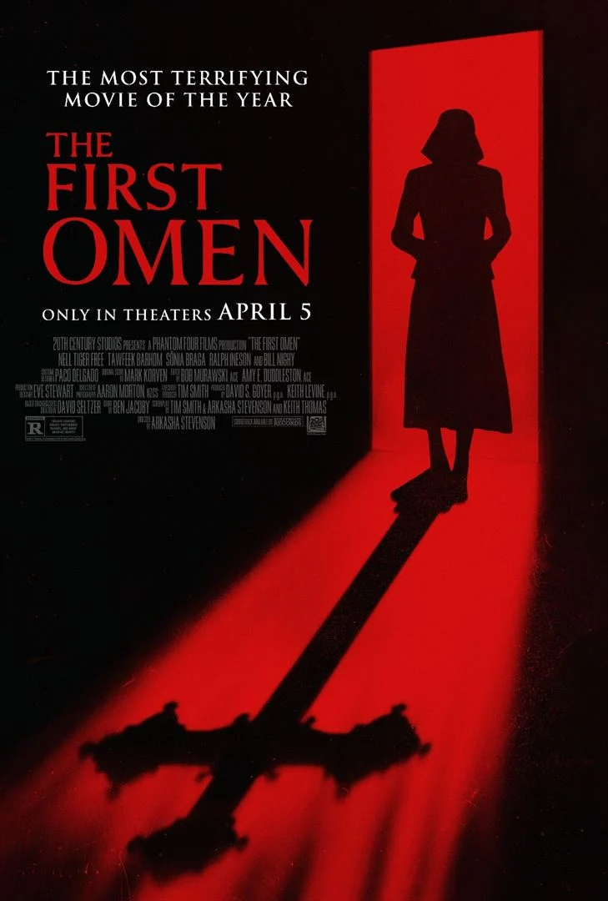
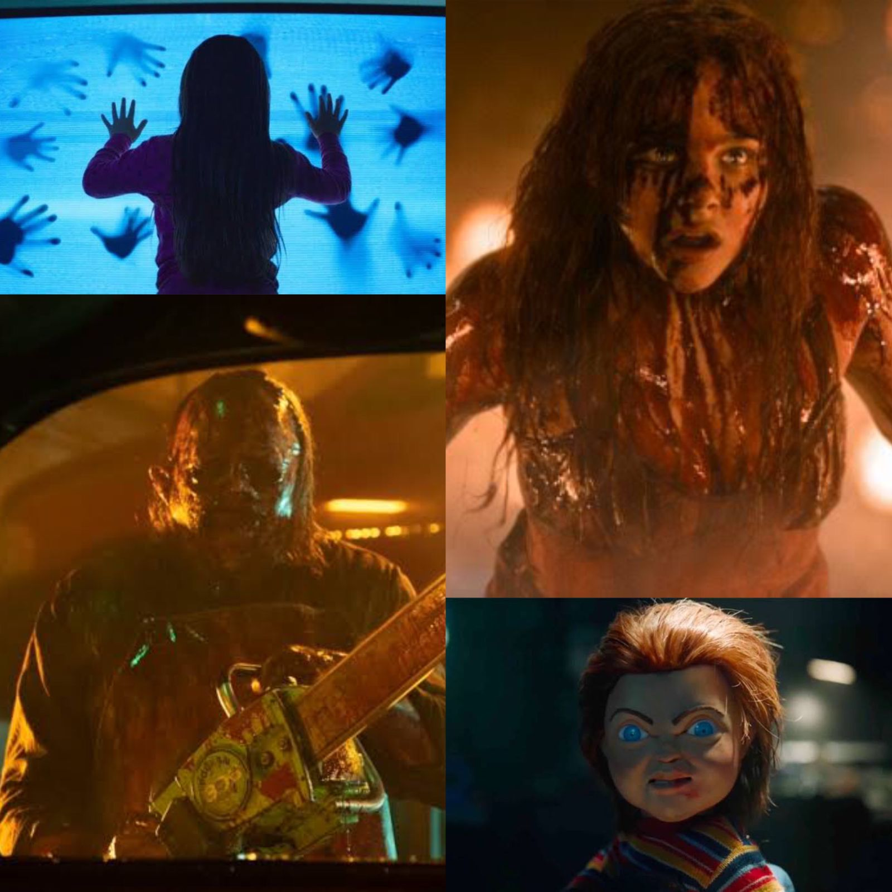
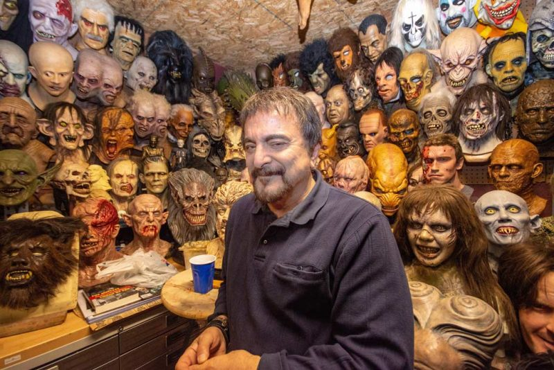
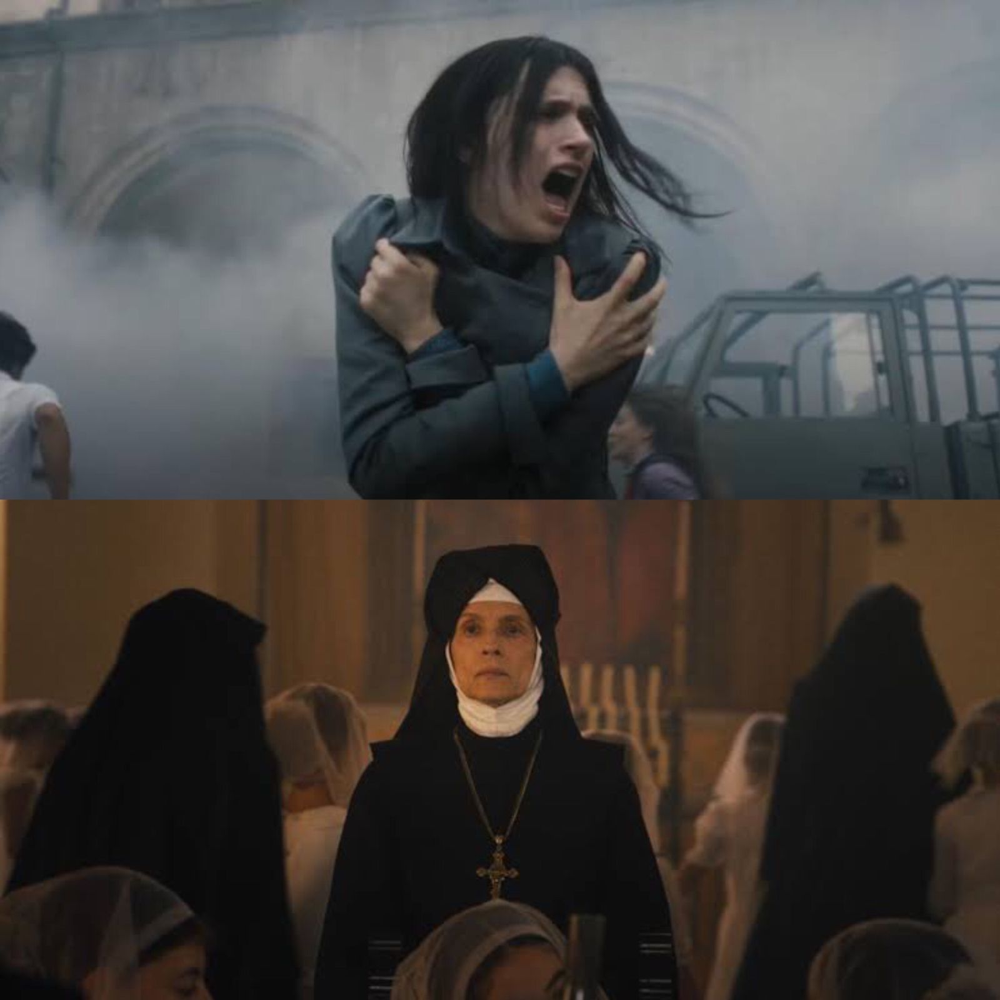
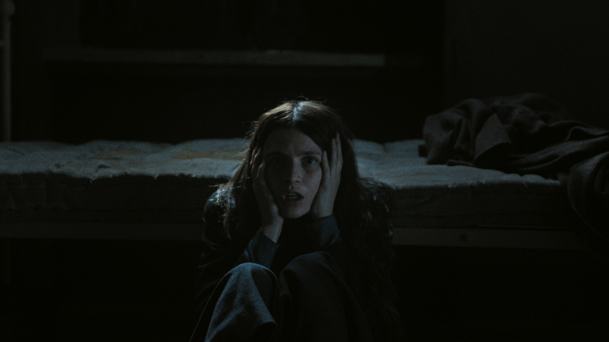
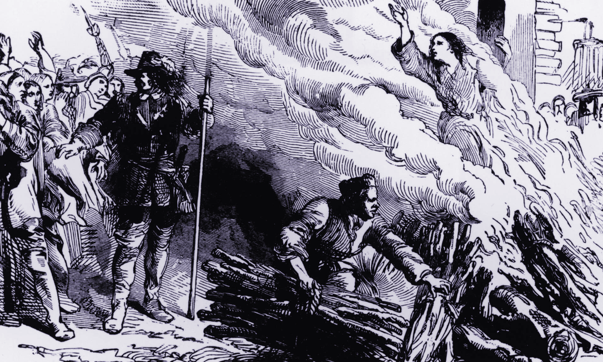
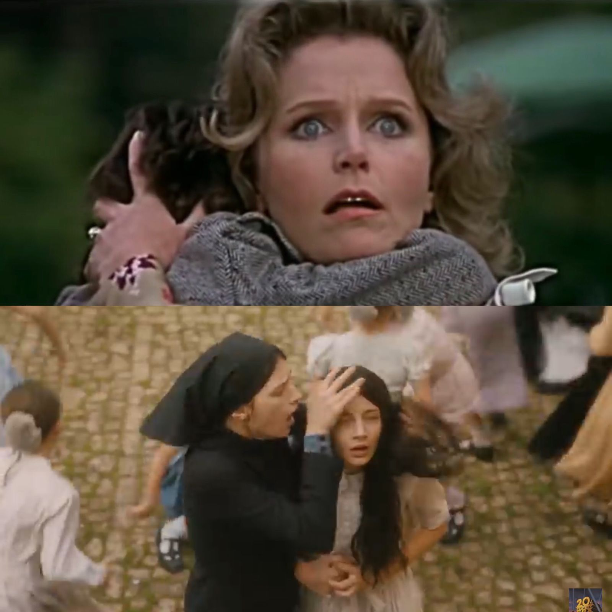
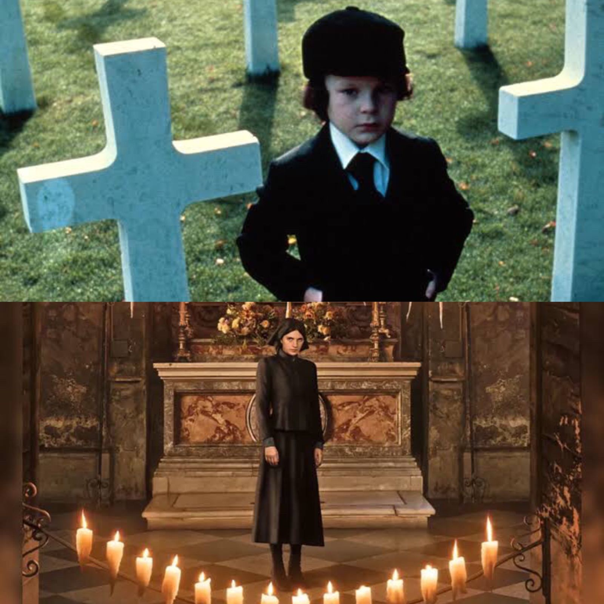
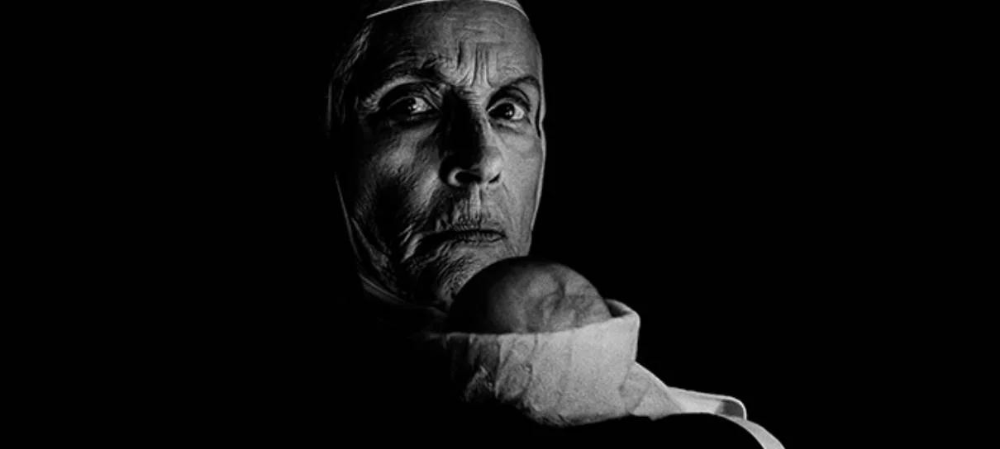

Filme de estreia da diretora Arkasha Stevenson, lançado pela distribuidora 20th Century, em abril de 2024, e se destaca como uma notável adição ao universo do terror. A Primeira Profecia funciona como um filme prequel, ou seja, um prelúdio ou ainda, uma história que precede a obra original, aqui em voga, A Profecia (1976) de Richard Donner. O que por sua vez, foi uma grata surpresa, visto que nos últimos anos, foi possível constatar uma certa onda de remakes, prequels, sequências e derivados de clássicas franquias. E devido às inúmeras investidas e um cenário saturado por sequências que frequentemente desapontam. A Primeira Profecia emerge como uma exceção, como uma obra muito bem executada, que trilha seu próprio caminho apesar de estar associada à um grande clássico do cinema, conseguindo abordar temas coerentes e concisos, proporcionando uma abordagem fresca e criativa acerca dos ditos “filmes endiabrados”. O que recebe ainda mais destaque quando nos lembramos que é uma audaciosa e excelente estreia da diretora e também da protagonista interpretada por Nell Tiger Free, pela primeira vez numa produção desse porte. Denotando o cuidado em realizar algo que de fato agregue de forma positiva para o gênero do terror, e não seja apenas só mais uma produção parte de uma coleção de sequências de filmes que se sustentam em clássicos.

<figure>
  
  <figcaption>Poltergeist: O Fenômeno (2015); Carrie: A Estranha (2013); O Massacre da Serra Elétrica: O Retorno de Letterface (2022); Brinquedo Assassino (2019), são exemplos de remakes que desapontam aos fãs e fomentam críticas ferrenhas.</figcaption>
</figure>

O filme apresenta a história da jovem Margaret (interpretada por Nell Tiger Free), enviada à Roma a serviço da igreja para uma cerimônia religiosa, a cerimônia do véu. Margaret então, começa a ter visões perturbadoras com a jovem Carlita (Nicole Sorace), uma jovem que vive de forma isolada no convento. Com a ajuda de um padre exonerado, que também já investigava o caso. Margaret descobre uma conspiração dentro da igreja, que fomenta articulações para o nascimento do anticristo, como forma de restauração da fé do povo, através do medo. Essa narrativa não só expande o universo de <strong>A Profecia</strong>, mas oferece também, uma crítica incisiva à opressão e violação dos corpos femininos, um tema atual e relevante.

O lançamento do filme original em 1976 ocorreu em meio a um período marcado por inúmeros conflitos e turbulências sociais e políticas, incluindo o pós guerra do Vietnã, a qual deixou marcas profundas e inextinguíveis nos Estados Unidos. Esse período marcado por desilusões e traumas, influenciou profundamente a indústria cultural como um todo, que visava retratar o contexto histórico. O que por sua vez, reflete na narrativa do filme, que busca a restauração da fé de um povo já desiludido e descrente, devido esse reflexo sociopolítico.

<figure>
  
  <figcaption>Tom Savini, maquiador de terror.</figcaption>
</figure>

Figuras conhecidas como o Tom Savini, maquiador, técnico em efeitos especiais cinematográficos, ator, cineasta norte-americano e também ex-fotojornalista de guerra, trouxe a violência visceral vivenciada, para o cinema em filmes como: Despertar dos Mortos; O Massacre da Serra Elétrica; CreepShow: Show de Horrores; Sexta-Feira 13, dentre outros. Os filmes de terror passaram então a incorporar elementos desse período traumático e desilusório às suas obras. Inclusive, o próprio clássico aqui em questão, “A Profecia”, não escapou dessa forte influência, levando em consideração que filmes como O Bebê de Rosemary (1968), O Exorcista (1973), e até mesmo A Profecia (1976), exploraram os medos apocalípticos e o conflito entre o bem e o mal, refletindo as ansiedades sociopolíticas da época. Se tornando deste modo, um marco no gênero do terror, que buscava refletir de forma visceral o impacto das guerras. A Primeira Profecia resgata essa atmosfera ao incorporar elementos do terror psicológico e visceral que caracterizaram os clássicos dos anos 60 e 70.

A atriz Nell Tiger Free, também conhecida por seu trabalho na série Servant (2019), está excelente em sua atuação neste longa, se encaixando perfeitamente como Margaret. Ela se destaca ao trazer uma profundidade emocional que cativa o público, sendo possível, até mesmo, notar elementos do giallo e do gore, executados de forma muito perspicaz por Nell, enfatizando sua excelente apresentação neste longa. Sua performance é complementada pela incrível Sônia Braga, que se encontra espetacular e assustadora no papel de Irmã Silvia, a Madre Superiora do convento. Ela é a responsável por acentuar e manter firmeza nas atrocidades que corroboram com o tom misterioso, ocultista e assustador da trama.

<figure>
  
  <figcaption>Nell Tiger Free como Margaret e Sônia Braga como Irmã Silvia, a Madre Superiora em A Primeira Profecia (2024).</figcaption>
</figure>

Tecnicamente, “A Primeira Profecia” é um triunfo. A fotografia granulada, remete à década de 70, criando uma ambientação autêntica que homenageia visualmente o filme original. A direção de fotografia utiliza enquadramentos inteligentes e movimentos de câmera que enganam o olhar do espectador, criando sustos e momentos de tensão de forma eficaz. O uso de cantos gregorianos na trilha sonora adiciona uma atmosfera sagrada e ao mesmo tempo macabra, intensificando o tom sombrio do filme.

<figure>
  
  <figcaption>Margaret transtornada com suas visões.</figcaption>
</figure>

Arkasha Stevenson demonstra uma habilidade louvável ao evitar clichês de terror baratos. Em vez de depender de sustos fáceis e abusar de <i>Jumpscares</i>, ela constrói o terror de forma lenta e deliberada, utilizando simbolismos sutis e críticas sociais incisivas. A sombra do hábito de Margaret, por exemplo, é usada como um símbolo do poder sobrenatural da igreja, o que reforça a ideia de que a igreja possui seu próprio “fantasma”, podendo ser representado pelo controle histórico sobre o comportamento e os corpos das mulheres. Como exemplo, podemos citar a Inquisição, conflito político-religioso que marca um período no qual as mulheres eram o principal alvo devido seus comportamentos, e suas execuções eram realizadas de inúmeras formas.

<figure>
  
  <figcaption>Ilustração de uma mulher sendo queimada após ser acusada de bruxaria. Segundo a filósofa Silvia Federici, que pesquisou a caça às bruxas.</figcaption>
</figure>

Esse uso simbólico conecta a narrativa a um paradigma mais amplo de dualidade entre o sagrado e o profano, sem abusar das referências ao filme original, mas ainda as utilizando pontualmente, como a clássica cena do suicídio.

<figure>
  
  <figcaption>Cena do suicídio em ambos os filmes</figcaption>
</figure>

É impressionante como apesar deste longa ir de encontro com o filme de 1976, Stevenson consegue exprimir autenticidade, trilhando o próprio caminho sem depender do filme anterior, construindo deste modo bastante sentido por meio da referência, sobretudo, abordando novos temas e modificações que juntas complementam uma nova proposta e identidade própria. Visto que enquanto “A Profecia” (1976) de Donner retratava a história de um diplomata americano que, após a perda de seu filho, e conselho de um religioso, aceita criar uma criança como se fosse seu falecido filho (criança esta, que vem a ser o anticristo). Já neste novo filme o foco se volta às origens e lutas de Margaret, mãe biológica de Damien. É interessante como Stevenson apresenta as mulheres como figuras de poder que definem o curso da história, em contraste à passividade feminina retratada no filme original. Essa mudança é particularmente significativa no contexto do terror, onde as mulheres são frequentemente preteridas a papéis de vítimas, sendo retratadas como objetos passivos. Stevenson as coloca no centro da narrativa, como agentes de transformação e poder, pois as mulheres são as responsáveis pelas decisões mais importantes e relevantes na trama. Como as próprias ações e planejamentos realizados por parte da Irmã Silvia (Sônia Braga), enquanto os padres apenas funcionam como suporte na execução desses planejamentos. Stevenson também utiliza do enredo de Margaret e suas visões assustadoras como uma metáfora, visto que em certo ponto a personagem questiona a veracidade de suas visões ao qual sempre a fizeram acreditar ser paranoia, enquanto no filme de 1976 a personagem Katherine que representa a mãe, é tida em determinado ponto como louca, chegando ao ponto de questionar sua própria sanidade. Um tema, que por sua vez, ressoa profundamente com debates atuais e relevantes. Ao considerar que Damien já possui seu enfoque nos filmes anteriores da franquia, aqui a história se volta para o corpo que o gera, é sobre Margaret e as mulheres que agem para o bem (ou no caso para o mal) em torno de toda essa narrativa. E essa abordagem crítica, não só enriquece o enredo, mas também proporciona profundidade ao filme, o elevando em relação às demais produções do gênero.

<figure>
  
  <figcaption>Damien em A Profecia (1976) e Margaret em A Primeira Profecia (2024).</figcaption>
</figure>

O longa apresenta alguns obstáculos, principalmente no último ato, como por exemplo, embora uma vasta extensão de tempo de tela, o filme parece não saber muito bem aonde pretende chegar de forma objetiva. E precisa se prolongar mais do que o necessário para concluir sua narrativa. Deixando ainda, uma brecha, algo que pode vir a ser usado futuramente como gancho para apresentar uma nova proposta e explorar outra vertente, já que A Primeira Profecia introduz a revelação de que Damien tem uma irmã gêmea, e a maneira como o gênero dessas crianças define o desfecho dessa primeira parte, sugere a possibilidade de uma sequência do longa. No entanto, é um excelente <i>debut</i> da diretora Arkasha Stevenson, que mostra respeito pelo material original ao mesmo tempo que infunde sua própria visão criativa. Essas mudanças propostas por Stevenson são inovadoras e se fazem necessárias nesse novo cenário, atualizando e abrindo espaço pra um olhar crítico que enriquece o gênero do terror.

<figure>
  
  <figcaption>Irmã Silvia na cena do parto de Damien.</figcaption>
</figure>

A Primeira Profecia transcende o rótulo de “mais um filme de franquia ou sequência”, pois é uma obra que incorpora viés político e uma causa significativa em seu núcleo. Arkasha Stevenson expõe seu olhar sensível para com a luta das mulheres, tanto no universo fictício do longa quanto na realidade contemporânea. O filme se destaca como uma valiosa contribuição, proporcionando uma nova perspectiva, que certamente irá marcar boa parte do público, podendo ainda estender essa abordagem para as demais obras de mesmo gênero, afinal, é de fato indecoroso a maneira a qual o corpo da mulher continua ainda hoje, disposto como algo ou um objeto a ser profanado e oprimido, independente de suas motivações e representações. O que retoma a importância dessa retratação narrativa e desse cuidado e representatividade, abordando todas essas questões como plano de fundo pra trama, de uma forma sutil e coesa, sem perder a coerência e relevância dentro do contexto da obra. O longa é indiscutivelmente, um dos melhores filmes de terror de 2024 (até o momento), de fato um <i>prequel</i> que rejuvenesce um clássico do terror, uma surpresa gratificante e uma prova de que é possível criar algo inovador e impactante dentro de uma franquia clássica.
