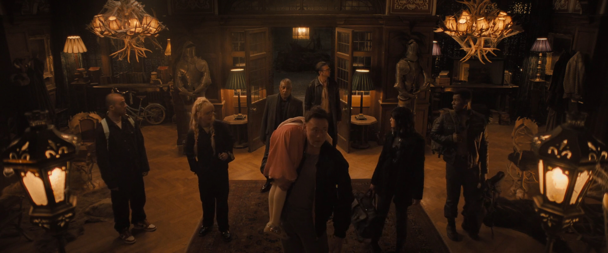

Dizem que a propaganda é a alma do negócio. Mas em certas ocasiões, menos é mais. O filme dirigido por Matt Bettinelli-Olpin e Tyler Gillett, que fazem parte da produtora Radio Silence (responsável por Pânico de 2022, Pânico VI e Casamento Sangrento), de início nos apresenta a um grupo de 5 pessoas que são contratadas para sequestrar uma garotinha e mantê-la refém por 24 horas na espera do pagamento do resgate feito pelo seu rico pai.

Antes de falar sobre o filme, tenho que comentar uma coisa: não entendi essa estratégia de marketing. Assisti o filme já sabendo do que se tratava, mas o roteiro é estruturado para fazer mistério do que vai acontecer. Assim… Pra que? Toda a divulgação mostra que a menina é uma vampira. Até o poster já passa essa ideia. Enfim, eu já gastei um parágrafo falando sobre isso. Vamos ao filme de fato.

O filme tem um humor escrachado e não se leva a sério em momento algum. O que pra mim, foi maravilhoso. Todos participam de momentos engraçados, mas o destaque vai para Kevin Durand que faz um personagem com o raciocínio lento demais. O humor também tem base na quebra de expectativa no que até então era lógico para alguns personagens. Os cenários não são variados, mas são bem construídos. Especialmente a mansão onde a maior parte do filme se passa.

    Aviso de Spoiler

Logo no início vemos cinco pessoas pondo em ação um plano para sequestrar Abigail (interpretada por Alisha Weir. A Matilda do musical da Netflix), após ela praticar ballet em um teatro. Temos Melissa Barrera interpretando Joey. Uma ex-médica militar que se viciou em drogas e agora trabalha como médica clandestina para a máfia; Dan Stevens (de Legion) interpretando Frank. Um ex-detetive que se corrompeu após passar um tempo sob disfarce numa operação; Will Catlett (ele esteve em Lovecraft Country) dando vida à Rickles, um atirador da marinha; Kevin Durand (ele foi o Blob do X-Men Origins: Wolverine) interpreta Peter. Um ex-capanga da máfia. Ele é grande, forte e intelectualmente lento; Kathryn Newton (a filha do Homem-Formiga naquele vergonhoso terceiro filme) interpreta Sammy. Uma hacker que atua roubando dinheiro das contas bancárias de pessoas ricas. E Angus Cloud (de Euforia que infelizmente faleceu antes do lançamento desse filme) interpretando Dean, um piloto de fuga.

Todos eles foram contratados pelo Lambert, que é interpretado pelo Giancarlo Esposito (o Gus Fring do Breaking Bad). Ele já realizou alguns trabalhos com o Frank e foi quem fez todo o planejamento dessa operação de sequestro. Após a captura da menina, todos se reúnem em uma antiga mansão afastada da cidade e são instruídos a passarem 24 horas no local para, após esse tempo, dividirem a quantia de 50 milhões de dólares do resgate. Com os telefones confiscados, utilizando nomes falsos (Sim. Todos os nomes que eu falei no parágrafo acima não são os verdadeiros nomes dos personagens. Mas sinceramente. Isso não importa muito) e sem a mínima ideia de quem seja o pai de Abigail, os cinco passam a socializar ali dentro da mansão. Eles podem usufruir de toda a área da casa, tendo livre acesso à cozinha e ao bar.

<figure>
  
  <figcaption>Momento em que o grupo entra na mansão</figcaption>
</figure>

Após Dean ser encontrado morto por Sammy, todos começam a desconfiar uns dos outros, pois eles descobriram que o pai de Abigail é Kristof Lazaar, um mafioso sinistro, que tem um capanga brutal e silencioso chamado Valdez. Então todos desconfiam que um deles é o Valdez. Após Rickles tentar sair da casa, todos se veem presos nela, pois o sistema de segurança foi acionado, fazendo do lugar uma prisão.

Ao tentar procurar uma saída, Rickles é morto, fazendo com que Joey confronte todos os outros integrantes do grupo. Frank é a favor de matar Abigail e fugir da casa, pois ela viu o rosto dele. Ele dá a ordem ao Peter que vai até o quarto onde a menina está fazendo com que Joey vá atrás pra impedir. Durante a discussão, Abigail se liberta das algemas e se revela uma vampira (surpresa!). Todos fogem do quarto. Mas Frank, antes de sair, atira na cabeça da Abigail - que não tem efeito, pois ela se regenera.

<figure>
  
  <figcaption>Abigail revela-se uma vampira</figcaption>
</figure>

Os personagens só aceitam que vampiros existem e pensam logo em estratégias para matar a Abigail. Eles pensam em usar estacas de madeira, usar o crucifixo de Peter como proteção e alho para repelir a criatura. Uma parte engraçada foi quando mandaram Sammy ir à cozinha para buscar alho e ela volta com cebolas, pois como ela não sabe cozinhar, ela não sabe a diferença entre um e outro.

<figure>
  
  <figcaption>Cebolas e alhos são bem parecidos</figcaption>
</figure>

Sammy, Peter e Frank pensam em ir pra cima de Abigail munidos de todos os itens mencionados acima. Porém Joey quer pensar numa estratégia melhor. Os três tentam confrontar a vampira, mas ela senta o sarrafo neles. Nesse momento, o filme quebra a expectativa quanto às fraquezas do vampiro, pois o alho e o crucifixo não fizeram nem cócegas nela. Mas você me pergunta: “e a estaca? Não funcionou?” Bom… Abigail usou a estaca para perfurar a perna do Frank. Então não deu muito certo.

Os três, então, voltam arrebentados ao cômodo onde Joey ficou esperando. Ela dá a ideia de sedar a menina, pois no início do filme vimos que Abigail pode ser sedada, como foi na hora do sequestro. Todos se separam para procurar a vampira pela mansão. Nesse meio tempo, Sammy cai numa piscina de corpos dando a entender que Abigail já matou muita gente ali. A vampira passa a perseguir Peter e no meio da confusão Abigail morde o braço de Sammy. Joey consegue sedar a menina e eles a trancam em uma cela.

<figure>
  
  <figcaption>Joey tratando do ferimento de Frank após o sarrafo que os três levaram</figcaption>
</figure>

Neste momento Abigail revela que todo o plano de sequestro era falso, que Lambert trabalha pra ela e que todos ali prejudicaram de alguma forma os negócios do pai dela. Rola ali uns diálogos expositivos sobre o passado de cada um, incluindo de Abigail que revela não ter um bom relacionamento com o pai. A vampira tenta manipular o grupo dizendo que ela deixaria vivo aquele que a libertasse da cela. Peter, sendo lento do jeito que é, tenta libertar a menina. Mas leva um tiro de raspão da Joey. Ela o leva junto com Sammy para outro cômodo para tratar do tiro que ela deu nele. Nisso Frank fica de vigia.

<figure>
  
  <figcaption>Abigail manipulando o grupo enquanto está presa</figcaption>
</figure>

Abigail, então, arranca a porta da cela mostrando que ela poderia sair dali quando ela bem quisesse. Enquanto ela tenta morder Frank, Joey volta e quebra um pedaço da parede. Fazendo com que um feixe de luz do sol ilumine a mão da vampira - que faz com que o punho dela exploda. Eles aproveitam enquanto ela se regenera para fugir dali em direção a biblioteca, se refugiando num espaço iluminado pela luz do sol. Mas e a Sammy? Ela não tinha sido mordida? Sim, mas nada aconteceu com ela.

Falando na Sammy, ela tem ideia de resetar o sistema de segurança da casa para que assim todos possam fugir dali. Eles se separam em duplas para procurar onde fica o sistema de segurança da mansão. Sammy se junta a Peter e Joey com Frank. É nesse momento que Abigail começa a controlar as ações da hacker como se ela fosse um fantoche. O filme apresenta um poder diferente para os vampiros. Aqui se uma pessoa é mordida, ela pode ser usada como um boneco que imita as ações do vampiro mestre. A pessoa só se torna um vampiro se, além de ser mordida, ela também beber o sangue do vampiro.

<figure>
  
  <figcaption>Abigail usando Sammy como um fantoche</figcaption>
</figure>

Sammy mata Peter enquanto é controlada pela Abigail. Ela passa a ir atrás de Joey e Frank, e os segue até a biblioteca onde é morta por Joey - que usa uma bandeja para refletir a luz do sol e fazer a hacker explodir fazendo com que sangue voe para todos os lados. Nesse momento se abre uma porta secreta que leva até a sala de controle. Na sala, Lambert os espera e revela que é um vampiro e que Abigail transformou ele há dois anos. Ele oferece a Frank uma oferta: transformar-se em vampiro para que os dois matem Abigail e o pai dela para, assim, tomarem controle de seu império da máfia. Oferta essa que Frank aceita.

<figure>
  
  <figcaption>Frank após a transformação</figcaption>
</figure>

Logo após ser transformado em vampiro, Frank mata Lambert enfiando a estaca de madeira em seu peito (Olha só! Então as estacas funcionam!) fazendo que ele também se exploda em sangue. Depois disso, Abigail chega até a sala de controle e ataca Frank, mas ele a agarra e morde o pescoço dela, deixando-a fraca. Enquanto isso, Joey desliga o sistema de segurança e tenta fugir da casa. Ao tentar fugir, ela se vê presa e deixa uma mensagem para o filho se desculpando por ser uma mãe ausente. Frank, então, a pega e diz que vai transformá-la em seu fantoche para fazê-la matar o próprio filho. Ela tenta se defender, mas Frank a lança do andar de cima da biblioteca.

Nesse momento Abigail salva Joey e diz que ela está muito fraca para conseguir lutar contra Frank e pede ajuda para enfrentá-lo, prometendo deixar Joey sair para ver seu filho novamente. Após acontecer uma luta ali (entre Abigail e Frank. Porque a Joey, coitada, quanto mais tenta ajudar mais ela apanha), Frank consegue deixar a vampira no chão e morde Joey para fazê-la virar seu fantoche. Ele ordena para que ela pegue a estaca e mate Abigail. Joey finge estar sendo controlada e tenta apunhalar Frank que a joga para longe. Como eu falei: ela sempre apanha quando tenta ajudar.

Depois de mais uma luta entre Abigail e Frank, agora ele que está no chão e a vampira esta tentando perfurar o coração dele com a estaca. Joey chega para ajudar e, finalmente, as duas conseguem matar Frank fazendo com o que aconteça? Isso mesmo. Que ele se exploda em sangue, pintando todo o cenário de vermelho com muitas vísceras espalhadas pra tudo que é lado. Abigail permite que Joey saia da mansão. Mas nesse momento chega seu pai que fica louco para beber o sangue de médica. A vampira o confronta, dizendo que Joey esteve ali presente enquanto seu pai não estava. O vampirão diz que veio quando ela precisava dele e que estava ali agora para ela, permitindo com que Joey saia da mansão. Ela então sai da casa, toda encharcada de sangue, e entra na van que o grupo utilizou para sequestrar Abigail e seguir em direção à cidade e voltar para seu filho.

<figure>
  
  <figcaption>Kristof Lazaar: O papito da Abigail</figcaption>
</figure>

Confesso que achei o final piegas. Porque a Abigail passa o filme inteiro tentando matar cada um dos integrantes do grupo e faz jogos de manipulação com todos. Ela está ali praticamente brincando com a comida, como ela mesma diz. E tudo bem ela querer atenção do pai. Acho inclusive que o filme deveria ter explorado mais um pouco essa parte. Mas não digeri muito bem essa mudança de índole em relação a Joey no final. Dizendo que ela esteve presente enquanto seu pai esteve ausente. Menina! Você estava tentando matar a Melissa Barrera o filme inteiro! Tem que rever seu conceito de chamar a atenção!

Mas esse final não deixou o filme menos divertido. Todos os atores estavam bem em seus papéis, em especial a Alisha Weir. Ela consegue ir bem de menina assustada para vampira assassina sanguinolenta e ameaçadora, passando bem a ideia de que ninguém ali tem chance contra ela.

Acho que Giancarlo Esposito ficou de escanteio e poderia ter sido mais utilizado. Ele só aparece no início e no final do filme. Ele é um excelente ator e muita gente o conhece de outros lugares como Breaking Bad e O Mandaloriano. Com certeza seria um atrativo para mais pessoas assistirem ao filme. Digo isso porque eu só fiquei sabendo que ele estava lá quando estava vendo no cinema. Foi uma surpresa boa, mas um pouco decepcionante por ele aparecer pouco.

Uma curiosidade: A Universal, estúdio responsável pelo filme, é dona dos direitos dos monstros clássicos do cinema. Ela tentou surfar na onda da Marvel e fazer um universo compartilhado de monstros. Mas o primeiro filme desse universo (A Múmia de 2017, com Tom Cruise) foi um fracasso enorme de bilheteria. O que fez com que o estúdio repensasse a estratégia. Eles começaram então a fazer filmes contidos reimaginando os monstros clássicos, como o filme excelente filme O homem invisível, de 2020. Eu dei todo esse contexto porque Abigail é uma releitura de A filha de Drácula (1936). Então se pode dizer que Kristof Lazaar é um dos nomes no qual Drácula é conhecido no universo desse filme.

Abigail foi um filme divertido por justamente não se levar a sério. O humor escrachado, a ação e as explosões de sangue com certeza vão agradar os fãs do subgênero vampiro.
