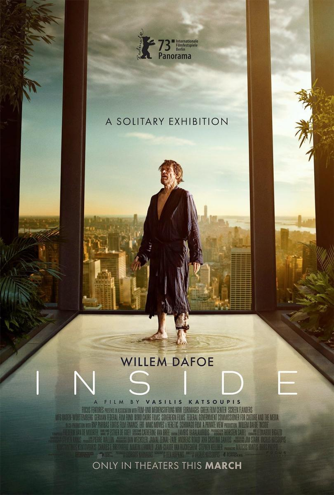
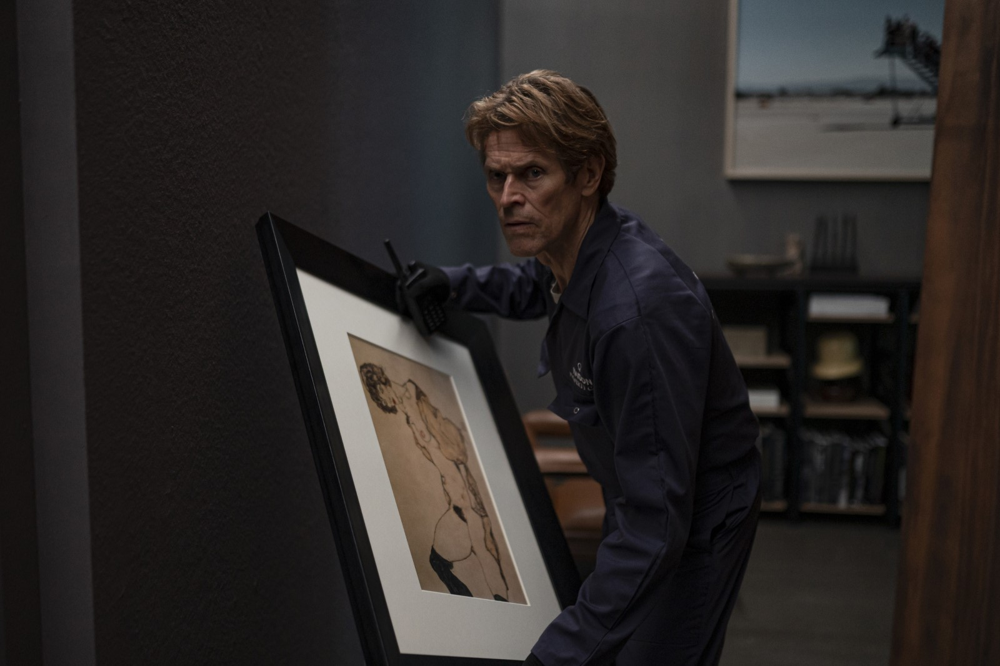
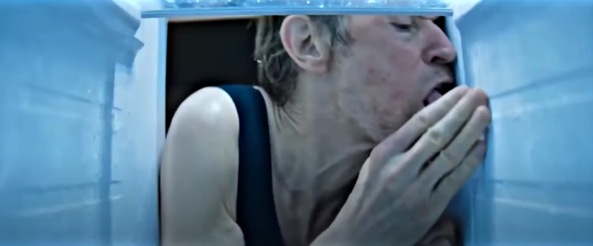
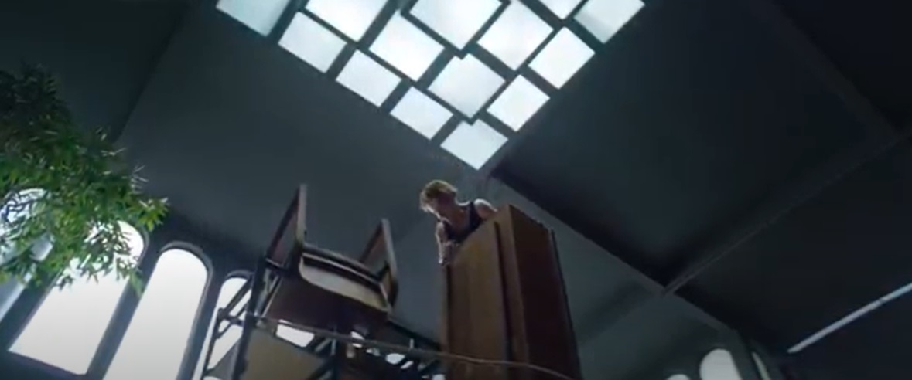
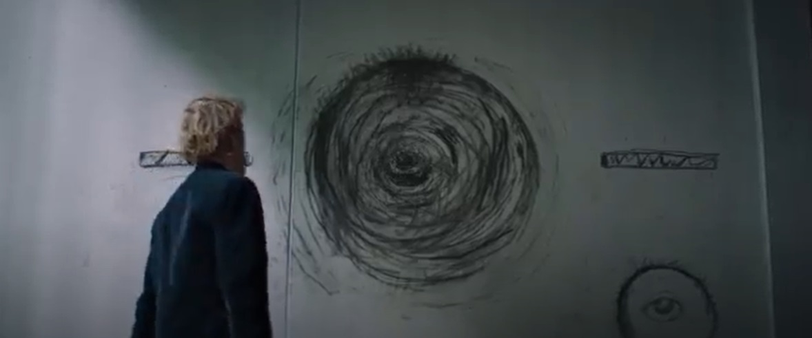

O filme Inside (Dentro), de 2023, protagonizado por Willem Dafoe – que dispensa apresentações, é dirigido pelo grego Vasilis Katsoupis, cujo roteiro é assinado por ele e Ben Hopkins. O filme mostra a angústia e o terror psicológico de um especialista em roubo de coleções artísticas, que, após uma tentativa frustrada de roubo de obras de artes em uma cobertura de luxo na cidade de Nova Iorque, se vê preso ao imóvel e precisa de talento para encontrar formas para conseguir sair do local. No início do filme fica claro a posição do protagonista. Desde criança ele desenhava, gostava de arte, carregava seu caderno de desenhos para onde fosse. Nunca se desfez dele. Seu caderno de desenhos era a memória de sua criação.

Em um primeiro momento o espectador pode sentir o roteiro monótono – quem vive a claustrofobia é o personagem principal. Mas Dafoe, com todo o talento que lhe acompanha, consegue manter a atenção do espectador ao longo dos 140 minutos do filme. Sabe quando você se coloca de frente para uma obra de arte a fim contemplá-la no seu íntimo silêncio? Você pensa que algumas conversam com você e outras são meras coadjuvantes que estão ali por qualquer sentido que você não vê, mas talvez o artista veja? Esse filme não é sobre o personagem principal, nem sobre a casa. É sobre você. É sobre observar uma obra de arte viva e em contínuo movimento.

<figure>
  
  <figcaption>Nemo com uma das obras do artista austríaco Egon Schiele.</figcaption>
</figure>

Enquanto a falha no sistema de segurança da cobertura promove o travamento das janelas blindadas e das portas, e provoca mudanças de temperatura, corte de comunicação exterior e corte hidráulico, o personagem Nemo se vê diante do desafio de sobreviver em um ambiente com inúmeras relíquias valiosas presas às paredes e espalhadas por toda casa.

Nemo realiza várias tentativas de sair daquela prisão, e a cada tentativa sem sucesso, percebe que é impossível sair de lá. No interior do imóvel é possível acessar as câmeras externas do edifício e assistir toda movimentação exterior, mas ninguém consegue ouvi-lo, vê-lo ou notar sua ausência. Nem mesmo a presença.

Com o sistema hidráulico cortado, limitação de suprimentos na geladeira – que quando aberta toca a canção Macarena (Los Del Rio) e avisa sobre os cuidados de uma alimentação saudável - sua única fonte de água vem do sistema de irrigação das árvores e plantas no interior da cobertura, que possui dia e hora para o acionamento automático. Nemo raciona o pouco que resta de alimentos e ração animal encontrados, e passa a travar uma luta por sua sobrevivência.

<figure>
  
  <figcaption>Nemo tentando consumir qualquer vestígio de suprimento existente na cobertura.</figcaption>
</figure>

Após várias tentativas infrutíferas de ser encontrado, Nemo começa a utilizar as paredes da casa como uma tela em branco e recolhe objetos destruídos por ele para criar suas próprias esculturas e formas. Ele constroi uma enorme torre com objetos da casa para que esta lhe sirva como subida de acesso ao conjunto de iluminação no teto da cobertura. O apartamento luxuoso possui o pé direito muito alto. Nemo precisa, então, recolher o máximo de móveis para construir sua torre de escalada. Sua aposta é que através desta estrutura, seria possível salvar-se, saindo da casa.

Alternando os dias e considerando sua situação degradante como o passar o tempo, entre a descoberta de um novo quadro escondido e as câmeras externas de TV, Nemo tem muitas dificuldades para retirar os parafusos presos à estrutura de metal que sustenta uma parte da peça de iluminação no teto da casa. Os parafusos eram de largo diâmetro e chumbados a uma estrutura de ferro que sustentava o teto do imóvel. Para isso, foi preciso construir por diversas vezes suas próprias ferramentas através de pedaços de madeira maciça que compunham os móveis do apartamento de luxo, pois as ferramentas se desgastavam muito rapidamente. A cada avanço no seu plano, Nemo precisava descansar como uma tentativa de se reestabelecer em breve para a continuidade do seu plano. Para isso, o protagonista se concentrava nos riscos e rabiscos que fazia nas paredes do apartamento. Era a sua própria construção artística que conversava com todo o drama que estava vivendo.

A grande torre que foi construída com objetos, ferros, madeiras, cordas e cortinas, pode ser vista pelo espectador como a incorporação de uma enorme escultura de arte no centro da cobertura de luxo. Muitas vezes o plano de filmagem propositalmente produz essa atmosfera.

<figure>
  
  <figcaption>Nemo tentando chegar às luminárias após empilhar móveis e objetos.</figcaption>
</figure>

Essa grande obra poderá ou não levar o personagem à sua maior obra prima final: a liberdade. Em contraponto, é no exterior da casa, através das janelas reforçadas, que Nemo avista um pombo – que teria um mundo inteiro para sobrevoar se não fossem suas asas quebradas. Nemo vê o símbolo da liberdade – uma ave – sucumbir à morte bem ali na sua frente.

Enquanto isso, o altar por ele criado, continua recebendo os restos de objetos provenientes das suas tentativas de criar ferramentas manuais para ajudá-lo a sair dali. Ou as “ferramentas” quebram, ou se desgastam ou não conseguem atingir o objetivo por ele perpetrado. Esse altar de objetos descartados se confunde à sua própria criação.

## VIDA E ARTE: A DESCONSTRUÇÃO COMO VIÉS E SUSTENTAÇÃO PSÍQUICA.

Os objetos por ele ali cunhados, são testemunha de uma tentativa de manter-se vivo, ativo, operando em direção à vida.

Estar vivo e sair daquele lugar que o aprisionou por meses e que ele nomeou como “jaula”, passa a ser a sua série artística. Sua tentativa desesperada de sair daquele lugar se confunde à sua criação. A criação passa a ser o seu algoz e sua possível salvação, pois, foi por causa das valiosíssimas pinturas existentes na casa que Nemo se submeteu a um assalto e, também, foram as peças de arte espalhadas por todo o imóvel que deram instrumentos subjetivos e materiais para que ele se mantivesse em luta pela vida. O que o atraiu para dentro daquele apartamento também foi o que sustentou seu psiquismo durante todos os meses em que permaneceu preso a ele.

<figure>
  
  <figcaption>O protagonista realizando um de seus desenhos na parede utilizando carvão em pó retirado de uma das esculturas da casa.</figcaption>
</figure>

A arte criada por ele, a partir de objetos destruídos e inutilizados, põe em xeque um novo sentido naquele contexto em que ele estava inserido, pois sustentava o pouco que ainda lhe restava de sanidade. Ora se confundia com uma peça que o tiraria de lá, ora com uma obra de arte deixada para admiração do espectador. Uma obra viva.

Ela cumpria quase a função de mantê-lo vivo no interior da casa, bem como servir de relato de memória de uma luta entre vida e morte a quem algum dia adentrasse aquele local. Inclusive, memória essa que Nemo, no início do filme, diz fazer questão de ter com ele, através de seus cadernos de desenhos. A arte, naquele espaço cuja experiência de isolamento angustia o espectador, poderia ser considerada uma espécie de possível refúgio para o personagem. Uma possível sustentação do imaginário frente ao desencadeamento da loucura.

Fica a pergunta: Nemo teve êxito na tentativa de sair da gaiola ou se tornou a grande exposição em que a arte imita vida e morte?
